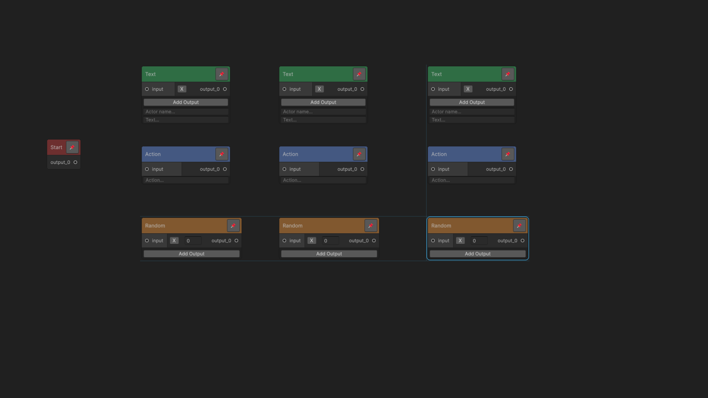
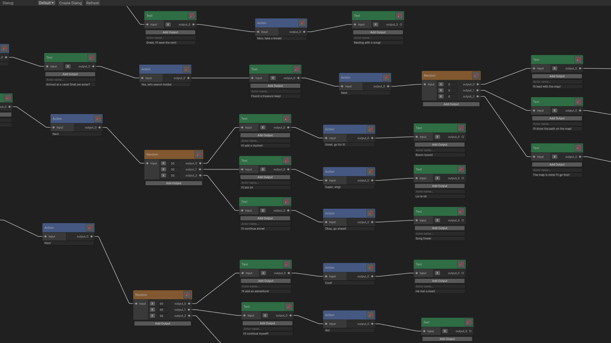
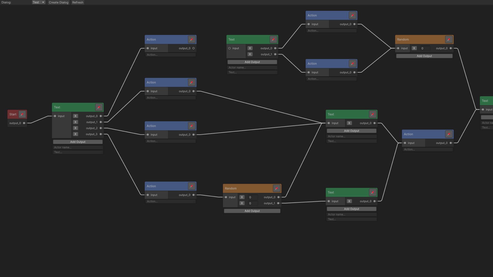
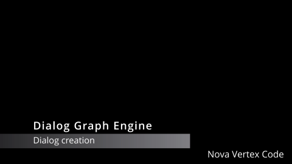

# Dialog Graph Engine
A robust Unity dialogue system for crafting interactive conversations. Use the node-based editor to design dialogue flows, manage branching narratives, and enhance your project's storytelling.

## Description
This Unity dialogue system enables the creation of interactive conversations with a node-based editor. It’s versatile for all genres, allowing you to design and manage branching narratives effortlessly. The content is fully customizable, supporting unique dialogue flows tailored to your project’s needs.

## Screenshots

## Features
- Node-Based Editor: Design dialogue flows visually with an intuitive graph interface.
- Branching Narratives: Create complex, branching conversations with multiple outcomes.
- Flexible Storage: Save and load dialogue nodes in any project folder.
- Color-Coded Nodes: Visually distinguish node types for better organization.
- Toolbar Integration: Quick access to dialog creation, switching, and refresh options.
- Customizable Nodes: Support for text nodes, action nodes, and randomization nodes, with the ability to extend node data.

## Documentation
[Download PDF Instructions](documentation.pdf)

## Video Tutorial

## Link
- [Download on Asset Store](https://assetstore.unity.com/packages/slug/12345)